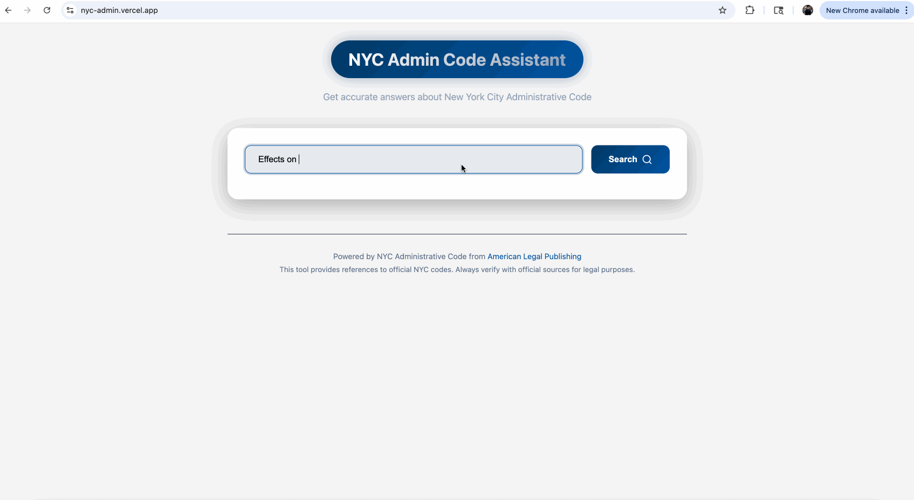

# NYC Admin Code Helper

## What Problem Does This Solve?

Finding and understanding specific rules in the New York City Administrative Code can be difficult and time-consuming, especially for non-lawyers. This project provides a simple web interface where anyone can ask questions about NYC laws and get clear, direct answers, with links to the official code.

## How Does It Work?

- **Ask a Question:** Type a question about NYC administrative rules (e.g., "What are the noise regulations for construction?").
- **AI-Powered Search:** The backend uses advanced AI (Google Gemini) and web scraping to find the most relevant sections of the NYC Administrative Code.
- **Clear Answers:** The app returns a concise answer, highlights the relevant law, and provides a link to the official code for further reading.

## Technologies Used

- **Frontend:** React
- **Backend:** FastAPI (Python) for the API, with:
  - Google Gemini (Generative AI) for understanding and answering questions
  - SerpAPI for web search and retrieving relevant code sections
  - Web scraping (BeautifulSoup, httpx) to fetch up-to-date admin code sections
  - Pydantic for data validation
